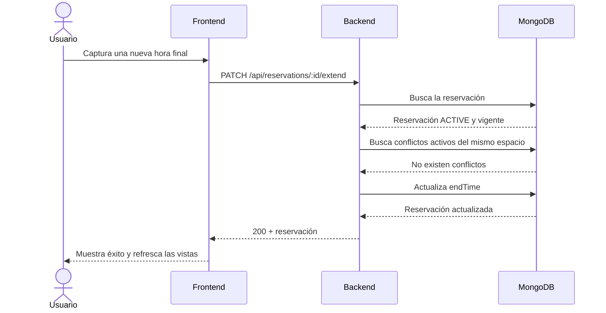
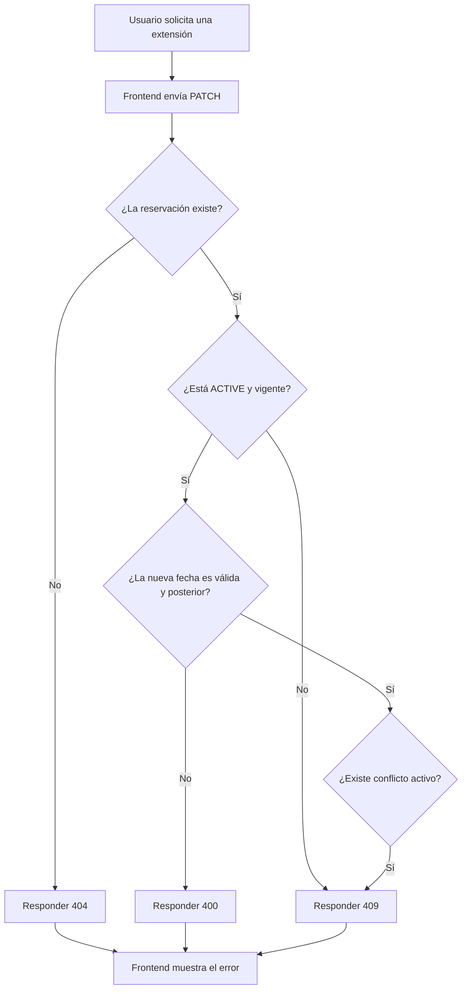
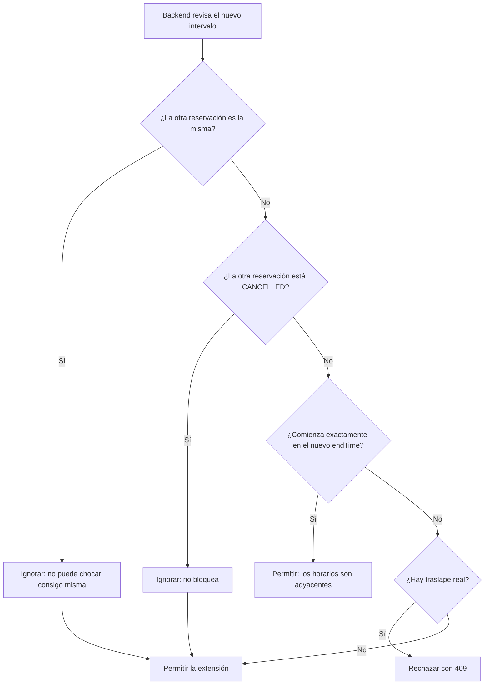

# Flujos de extensión de reservaciones

## Happy Path

```mermaid
sequenceDiagram
    actor U as Usuario
    participant F as Frontend
    participant B as Backend
    participant DB as MongoDB

    U->>F: Captura una nueva hora final
    F->>B: PATCH /api/reservations/:id/extend
    B->>DB: Busca la reservación
    DB-->>B: Reservación ACTIVE y vigente
    B->>DB: Busca conflictos activos del mismo espacio
    DB-->>B: No existen conflictos
    B->>DB: Actualiza endTime
    DB-->>B: Reservación actualizada
    B-->>F: 200 + reservación
    F-->>U: Muestra éxito y refresca las vistas
```

## Error Cases

```mermaid
flowchart TD
    U[Usuario solicita una extensión] --> F[Frontend envía PATCH]
    F --> B{¿La reservación existe?}
    B -- No --> E404[Responder 404]
    B -- Sí --> S{¿Está ACTIVE y vigente?}
    S -- No --> E409[Responder 409]
    S -- Sí --> V{¿La nueva fecha es válida y posterior?}
    V -- No --> E400[Responder 400]
    V -- Sí --> C{¿Existe conflicto activo?}
    C -- Sí --> E409
    E404 --> M[Frontend muestra el error]
    E400 --> M
    E409 --> M
```

## Edge Cases

```mermaid
flowchart TD
    A[Backend revisa el nuevo intervalo] --> B{¿La otra reservación es la misma?}
    B -- Sí --> I[Ignorar: no puede chocar consigo misma]
    B -- No --> C{¿La otra reservación está CANCELLED?}
    C -- Sí --> I2[Ignorar: no bloquea]
    C -- No --> D{¿Comienza exactamente en el nuevo endTime?}
    D -- Sí --> P[Permitir: los horarios son adyacentes]
    D -- No --> E{¿Hay traslape real?}
    E -- Sí --> R[Rechazar con 409]
    E -- No --> OK[Permitir la extensión]
    I --> OK
    I2 --> OK
```